# Security Group and Key Pair
### Security Group
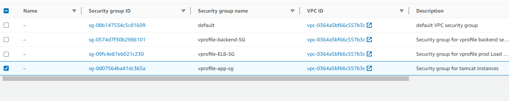
### Key Pair
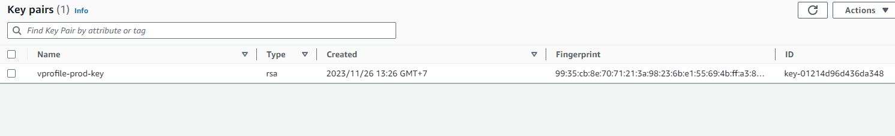

# Instances
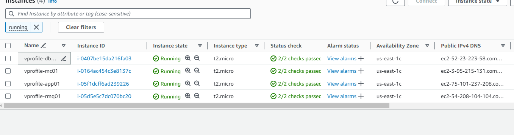
### Mariadb
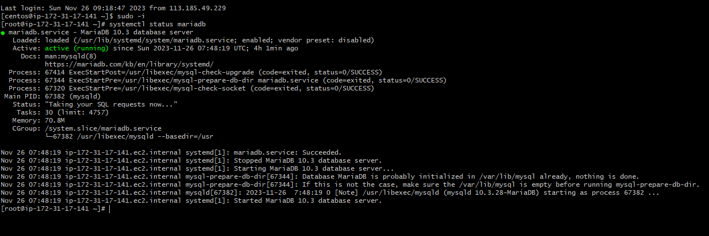
### Memcache
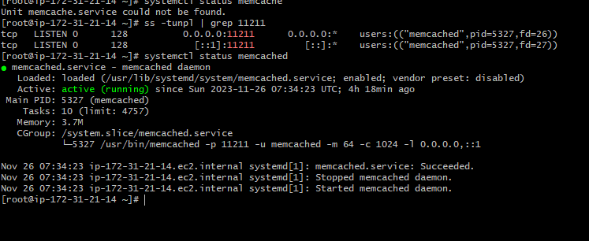
### RabbitMQ
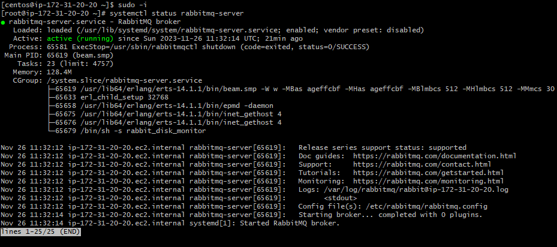
### Tomcat 9
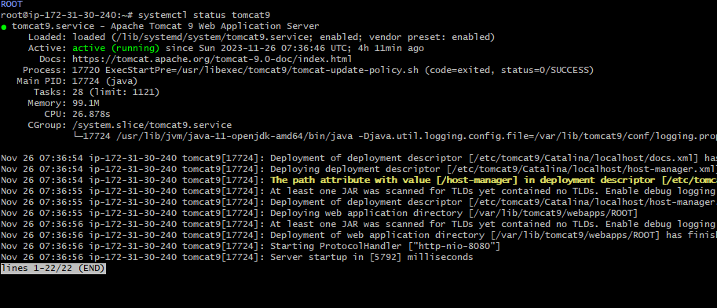

# Build and Deploy Artifacts
### Bucket
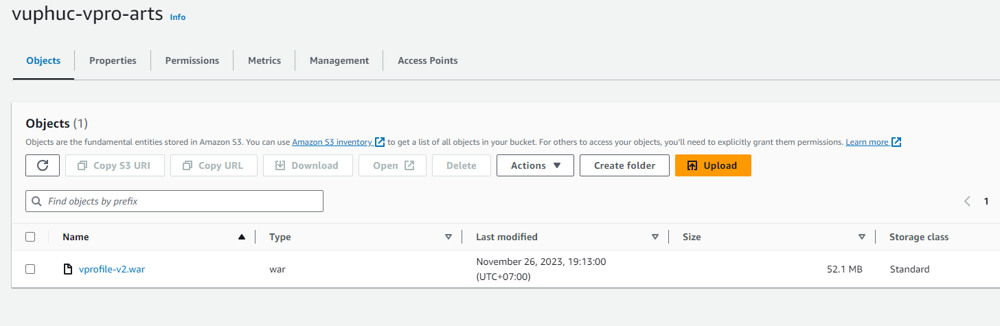
### Host Zone

# Load Balancer
### Target Group
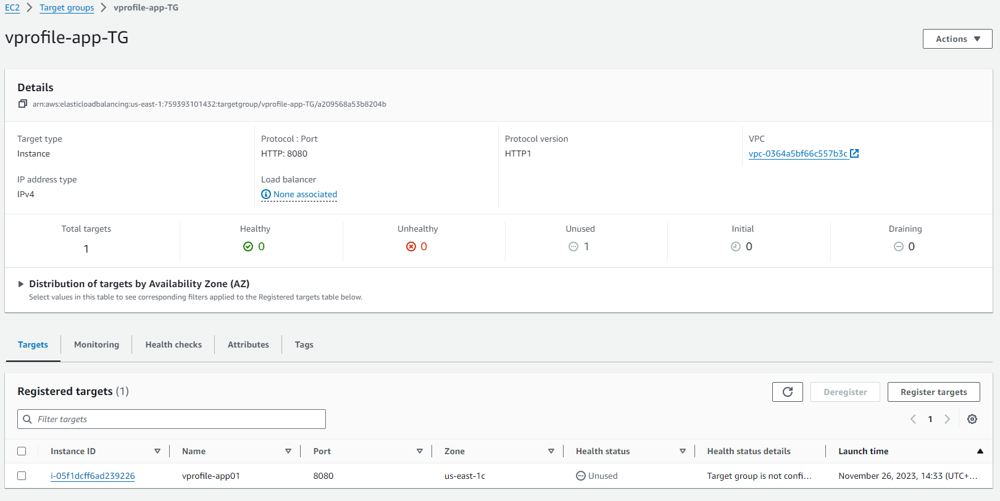
### Load Balancer
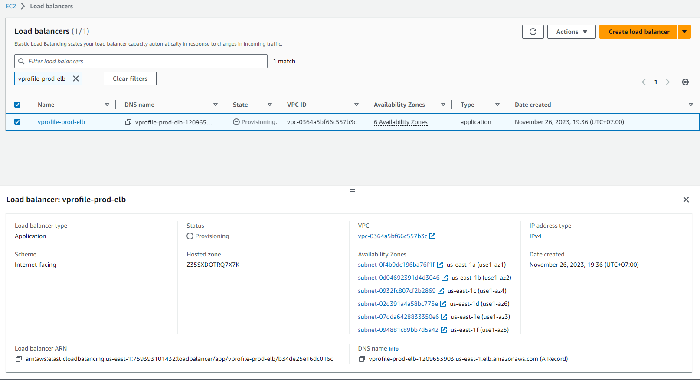

# Autoscaling Group
### Image
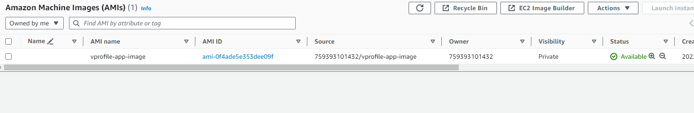
### Launch Template
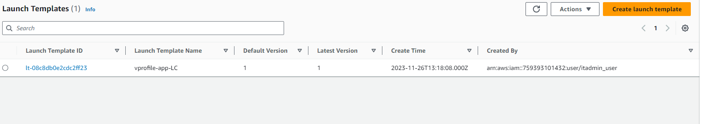
### Auto Scaling Group
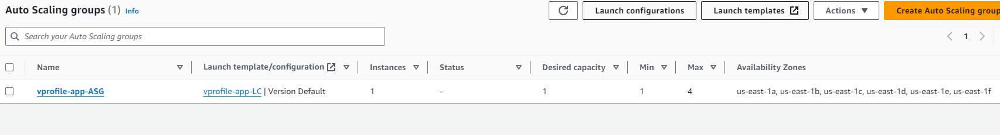

