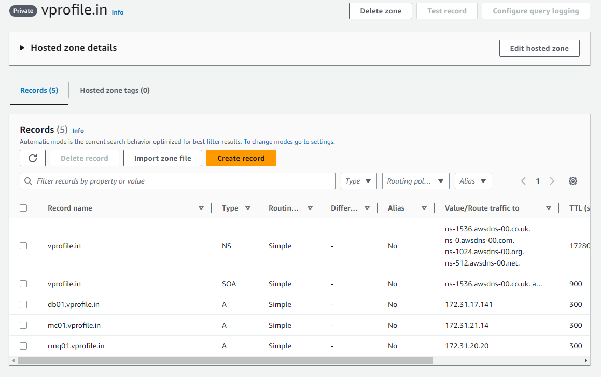

# Security Group and Key Pair
### Security Group

### Key Pair

# Instances

### Mariadb

### Memcache

### RabbitMQ

### Tomcat 9

# Build and Deploy Artifacts
### Bucket

### Host Zone

# Load Balancer
### Target Group

### Load Balancer

# Autoscaling Group
### Image

### Launch Template

### Auto Scaling Group

